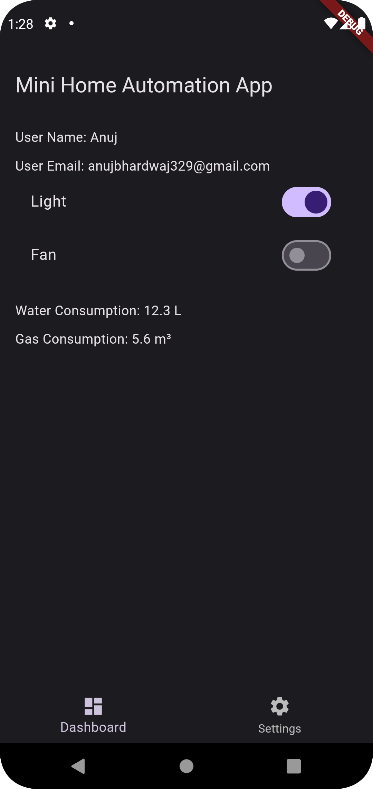
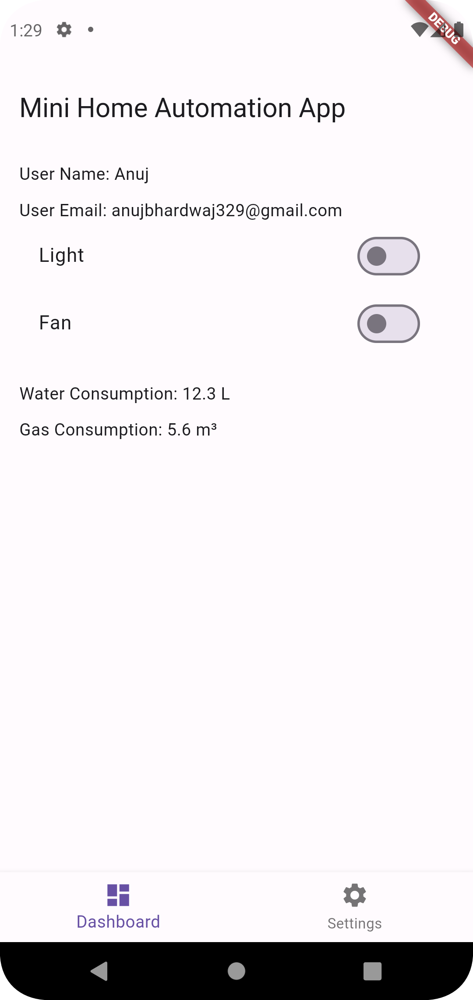
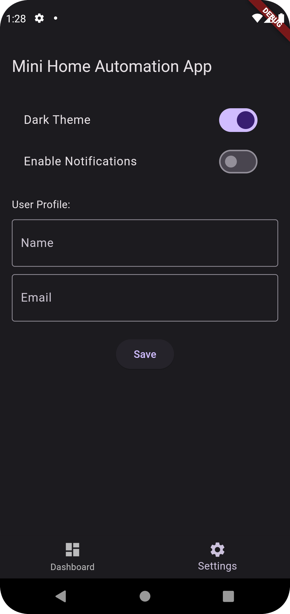
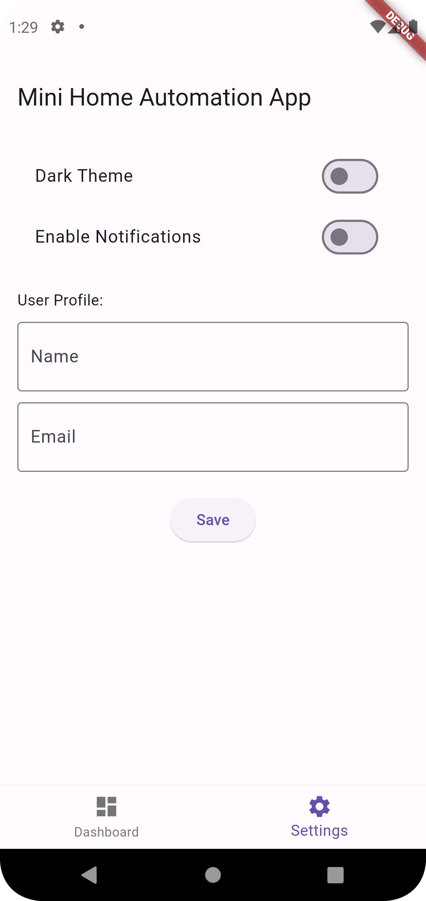

# Mini Home Automation App

The Mini Home Automation App features a streamlined interface with two main screens—a Dashboard to monitor and control devices, and a Settings page to adjust user preferences.

## Objectives

- Develop a functional app focusing on a Dashboard and Settings screen.
- Utilize Flutter to create a user-friendly and visually appealing interface.
- Demonstrate effective data handling between UI components and simulated data sources.

## Features

### Dashboard Screen

- **Device Control**: Includes control switches for devices like lights and fans.
- **Real-Time Data Display**: Displays consumption data for water and gas.
- **User Info**: Shows user name and email from the Settings screen.

### Settings Screen

- **Theme Changes**: Toggle between light and dark themes.
- **Notification Settings**: Enable or disable notifications.
- **User Profile Modifications**: Update and save user name and email.

## Technical Requirements

- **Flutter for Frontend**: Uses the latest stable version of Flutter.
- **Data Simulation**: Simulates device and sensor data using local JSON files.
- **Responsive Design**: Ensures the app functions well on both phones and tablets.

## Setup Instructions

1. **Install Dependencies**

   flutter pub get

2. **Configure Assets**

   Create a directory named assets in the project root.
   Inside assets, create a file named data.json.

3. **Update pubspec.yaml**

   Ensure the assets directory is declared in pubspec.yaml:
   flutter:
  assets:
    - assets/
    
4. **Run the App**
      flutter run

## Code Structure
- main.dart: The entry point of the application, handling navigation and state management.
- DashboardScreen.dart: Contains UI for device control and real-time data display.
- SettingsScreen.dart: Manages theme, notification settings, and user profile.

## Assumptions and Decisions
- Theme Management: Used ValueNotifier<ThemeMode> for dynamic theme changes.
- Data Simulation: Incorporated local JSON for simplicity in simulating device data.
- State Management: Managed user information state within MyHomePage using setState.
- Responsive Design: Ensured compatibility across different screen sizes.

##  Deliverables
- Source Code: Complete source code of the project is available in the repository.
- Screenshots: Images of the screens are attached below.
- Documentation: This README file includes setup instructions, feature descriptions, and development decisions.

## Screenshots

### Dashboard Screen Dark

### Dashboard Screen Light

\

### Settings Screen Light

### Settings Screen Dark

   
